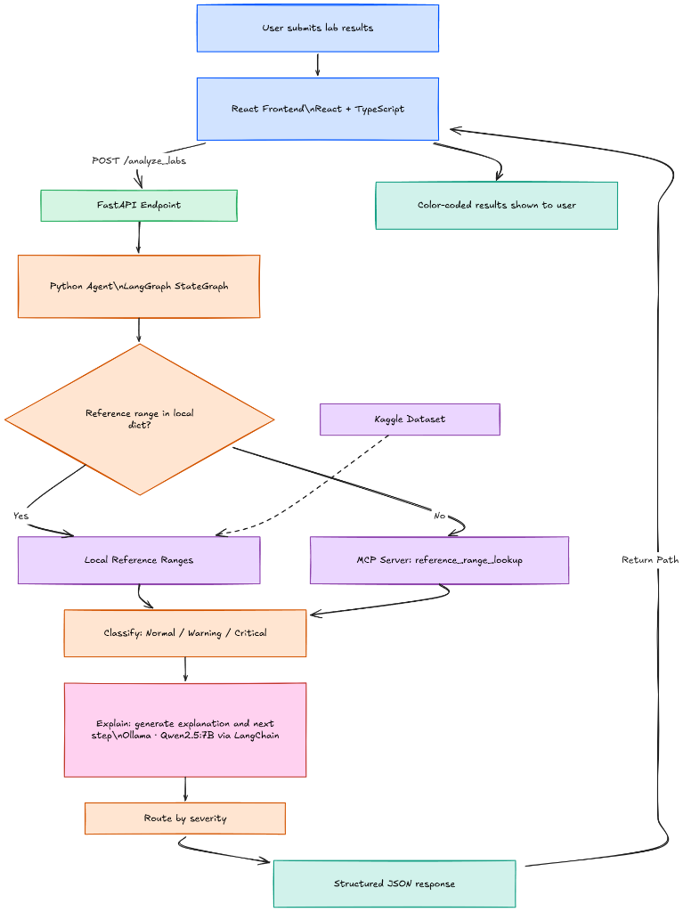
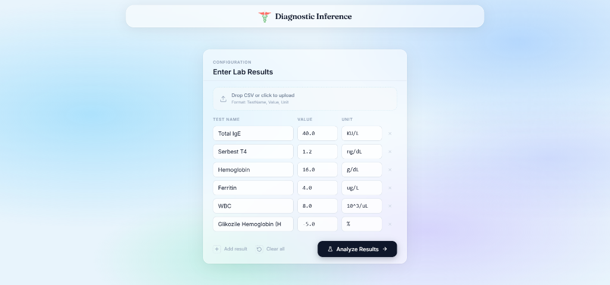
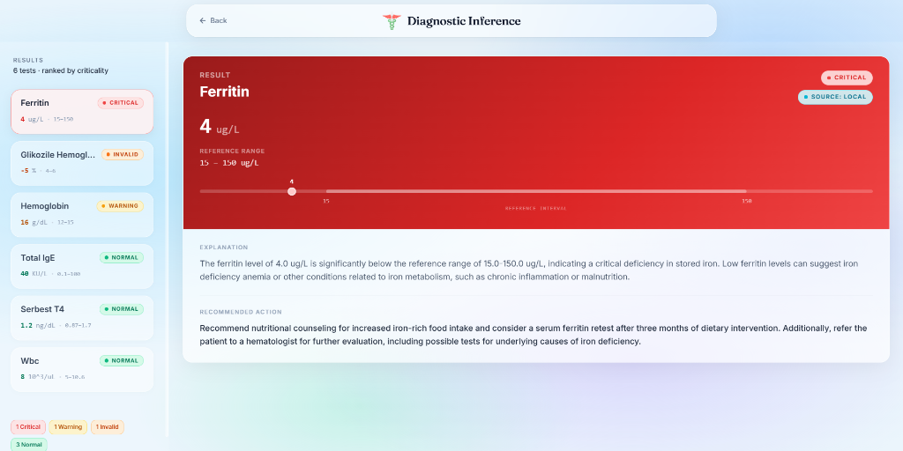

# Diagnostic Inference - Clinical Lab Results Analyzer

<p align="left">
  
  
  
  
  
  
</p>

An AI-powered clinical lab results analyzer that classifies laboratory test results by severity, explains findings in plain clinical language, and suggests next steps — built with a deterministic classification engine paired with real-time LLM-generated explanations.

## Architecture



**Key design principle:** classification is fully deterministic (Python, rule-based) — the LLM never decides severity. The LLM is used exclusively to generate natural-language explanations and next steps, grounded in the already-determined classification and reference range. This keeps the system explainable and auditable, and avoids the LLM inventing or overriding clinical facts.

## Screenshots





## Data Source

Reference ranges are sourced from the Kaggle **"Laboratory Test Results – Anonymized Dataset"**. Numeric tests are loaded into a local reference dictionary at startup; a small subset of tests are deliberately excluded from the local dictionary and routed through the MCP server instead, to demonstrate the Agent's tool-calling fallback path.

String/qualitative-result tests present in the raw dataset (e.g. strip tests returning "Negatif" or "1+") are out of scope for this implementation, which focuses on numeric lab values.

## Classification Logic

- **Normal**: value falls within the reference range
- **Warning / Critical**: value falls outside the range; severity is determined by percentage deviation from the nearest boundary
- **Invalid**: value is not a plausible clinical measurement (e.g. negative Hemoglobin)
- **Unknown**: test name has no available reference range, even via MCP

**Threshold note:** this implementation uses a percentage-deviation threshold (default 30%, with narrower overrides for a small number of tests where smaller deviations are more clinically significant) to separate Warning from Critical. This is a simplified engineering approximation for this assignment, not a clinically validated cutoff. In a production system, critical thresholds would come from clinically validated, per-test critical value tables (e.g. CLIA-regulated panic value lists) reviewed by medical professionals — not a percentage formula.

## MCP Integration

The Agent calls an MCP server tool, `reference_range_lookup(test_name)`, when a requested test isn't found in the local reference dictionary. This models a real-world pattern where reference data may live in an external system rather than being fully embedded in the application. The response includes a `reference_source` field (`"local"` or `"MCP"`) so the origin of every reference range is visible in the output.

## Tech Stack

- **Frontend**: React, TypeScript, Tailwind CSS
- **Backend API**: FastAPI (Python)
- **Agent**: Custom Python orchestration (Classify → Explain → Route) using LangGraph
- **Tool integration**: MCP (Model Context Protocol) server for reference range lookup
- **LLM**: Local Ollama Model (Qwen2.5:7B via LangChain `OllamaLLM`)
- **Data source**: Kaggle Laboratory Test Results – Anonymized Dataset

## Setup

### Prerequisites
- **Python 3.10+**
- **Node.js 18+**
- **Ollama**: Must be installed and running locally.

### 1. Start the LLM (Ollama)
```bash
# Pull the required model
ollama pull qwen2.5:7b

# Ensure the Ollama server is running (usually runs in background automatically)
ollama serve
```

### 2. Backend
*(Note: No `.env` configuration is required since the LLM runs locally. The MCP server is imported and runs directly in the same process, so no separate MCP startup is needed).*

```bash
cd backend
python -m venv venv
source venv/bin/activate  # Or `venv\Scripts\activate` on Windows
pip install -r requirements.txt
uvicorn main:app --reload
```

### 3. Frontend
```bash
cd frontend
npm install
npm run dev
```

### 4. Test Data
Working test files are located in the `/test_data` directory. You can drag and drop these CSV files directly into the React frontend to test the analysis pipeline.

## API

**POST** `/analyze_labs`

Request:

```json
{
  "labs": [
    { "test_name": "Hemoglobin", "value": 5, "unit": "g/dL" }
  ]
}
```

Response:

```json
{
  "results": [
    {
      "test_name": "Hemoglobin",
      "value": 5,
      "unit": "g/dL",
      "ref": { "min": 12, "max": 15, "unit": "g/dL" },
      "reference_source": "local",
      "status": "Critical",
      "explanation": "...",
      "next_step": "..."
    }
  ]
}
```

## Testing

Three synthetic test CSVs are provided in `/test_data`, covering Normal, Warning, and Critical cases derived from the Kaggle dataset's actual test names and reference values.

Manual test coverage includes: boundary values at range edges, invalid/malformed input, unknown test names (MCP fallback), missing units, and LLM/MCP service unavailability (graceful degradation, no crash).

## Scope & Limitations

- Designed exclusively for numeric lab tests with absolute reference intervals.
- Qualitative "strip" tests (e.g., tests returning "Negatif") are out of scope.
- Non-numeric inputs gracefully degrade to `UNKNOWN` instead of crashing.
- Avoids fake severity mapping, leaving complex LOINC integrations to production LIS systems.
